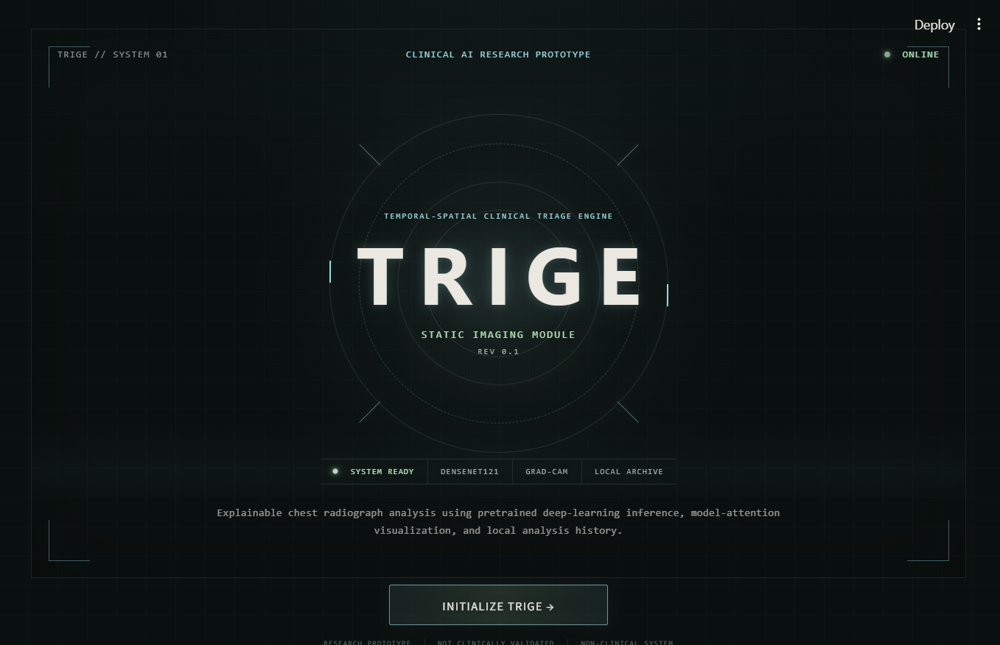

# TRIGE

### Multimodal Temporal-Spatial Clinical Triage Engine

**v0.1 — Static Imaging Module**

Trige is an explainable medical-AI research prototype that explores how medical imaging can serve as one component of a future multimodal clinical triage system.

The current v0.1 release focuses on static chest X-ray analysis. It uses a pretrained DenseNet121 model through TorchXRayVision, surfaces a pneumonia-associated model score, provides model explainability, and stores analysis metadata locally using SQLite.

> **Research and educational prototype only.**  
> Trige has not been clinically validated and is not intended for diagnosis, treatment, triage decisions, or other patient-care use.

---

## Demo

▶ **[Watch the Trige v0.1 Demo](https://youtu.be/GUdw_is1dmI)**



---

## What Trige Is

Trige is a research prototype for exploring how an imaging inference pipeline can be connected to a transparent interface, explainability tools, and local analysis history.

The long-term vision is to combine:

- chest radiographs
- 48-hour physiological vital-sign trajectories
- temporal modeling
- multimodal feature fusion
- deterioration-risk prediction

These multimodal components are **planned future work** and are not implemented in v0.1.

The current release integrates an existing pretrained medical imaging model. It does not introduce a newly trained clinical model or establish clinical performance.

---

## Current v0.1 Capabilities

Trige v0.1 currently supports:

- Uploading de-identified chest X-rays in PNG, JPG, or JPEG format
- Previewing the uploaded image
- TorchXRayVision preprocessing
- Pretrained DenseNet121 inference using `densenet121-res224-all`
- Pneumonia-associated model score display
- Supporting pretrained chest X-ray model outputs
- Grad-CAM model explainability
- Model attention-map visualization
- Coarse regional attention analysis
- LOW / ELEVATED demonstration flag
- SQLite analysis-history storage
- Scan-history metrics and table
- Streamlit-based research interface

The pneumonia-associated score is displayed as a raw model output and is not converted into a clinical probability.

The LOW / ELEVATED flag uses a demonstration threshold and does not represent a validated clinical classification.

---

## Architecture

### Current — Implemented in v0.1

```text
Chest Radiograph
       │
       ▼
TorchXRayVision Preprocessing
       │
       ▼
DenseNet121
       │
       ├── Pneumonia-associated model score
       ├── Supporting pathology outputs
       │
       ▼
Grad-CAM Explainability
       │
       ▼
Model Attention Analysis
       │
       ▼
SQLite Analysis Record
       │
       ▼
Streamlit Interface